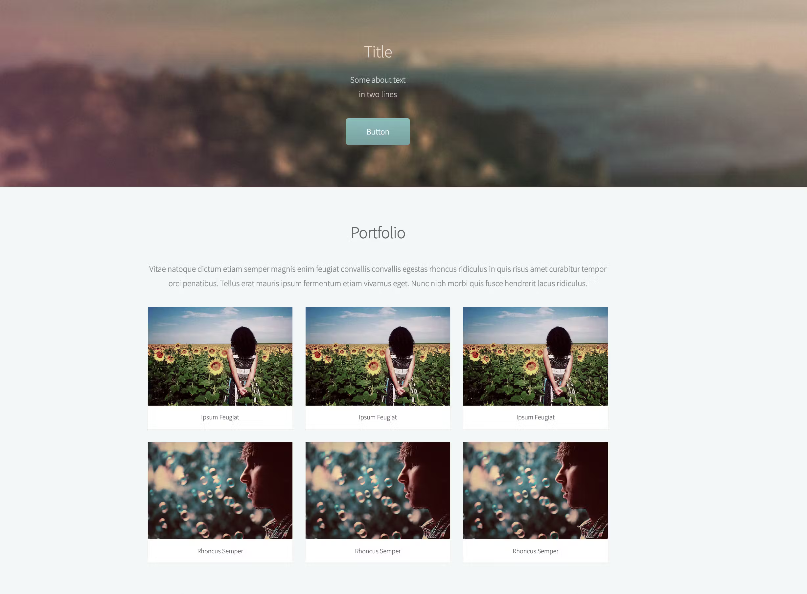

# Praktika

1. susikurti nauja Vite react projekta
2. jame atvaizduoti berizni 
3. susikaidyditi i komponentus
4. generuoti komponentus su MAP()
5. visi paveiksleliai ir pavadinimas po paveiksleliais turetu buti skirtingi
